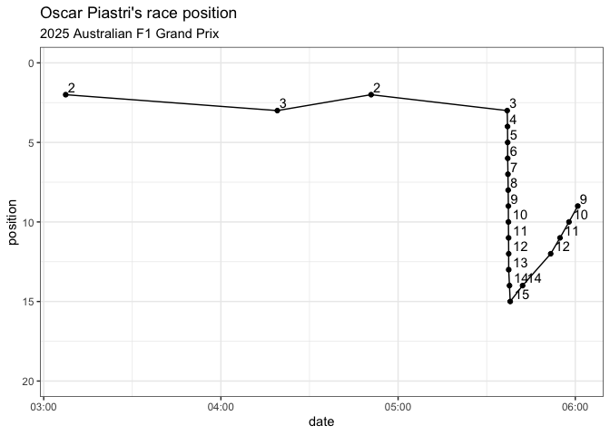
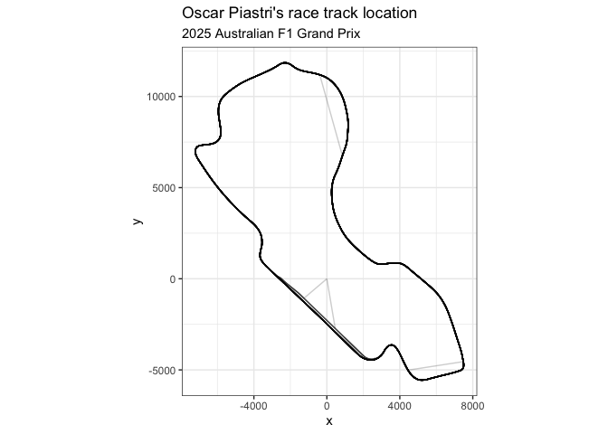
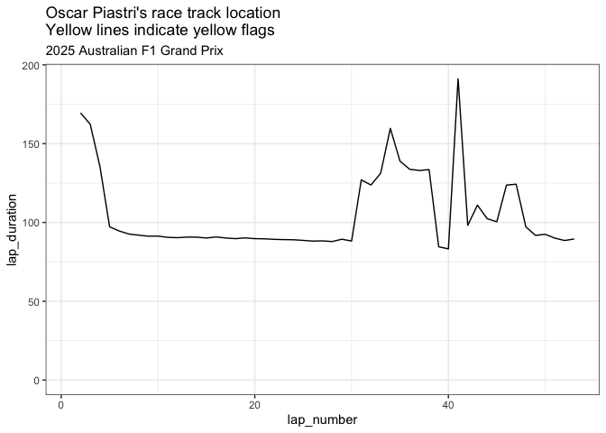
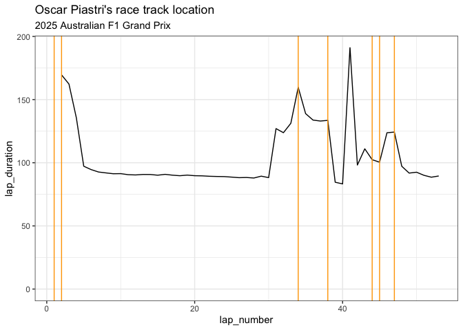
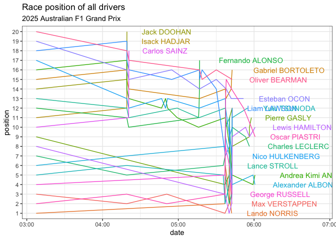

<!-- README.md is generated from README.Rmd. Please edit that file -->

# openf1r

<!-- badges: start -->


[](https://CRAN.R-project.org/package=openf1r)
[](https://github.com/coolbutuseless/openf1/actions/workflows/R-CMD-check.yaml)
<!-- badges: end -->

`{openf1r}` is a package for fetching Formula 1 race data from the
[OpenF1 API](https://openf1.org).

### What’s in the box

- `f1_cars()` Some data about each car, at a sample rate of about 3.7
  Hz.
- `f1_drivers()` Provides information about drivers for each session.
- `f1_intervals()` Fetches real-time interval data between drivers and
  their gap to the race leader. Available during races only, with
  updates approximately every 4 seconds.
- `f1_laps()` Provides detailed information about individual laps.
- `f1_locations()` The approximate location of the cars on the circuit,
  at a sample rate of about 3.7 Hz.
- `f1_meetings()` Provides information about meetings i.e. a Grand Prix
  or testing weekend. Usually includes multiple sessions (practice,
  qualifying, race, …).
- `f1_pits()` Provides information about cars going through the pit
  lane.
- `f1_positions()` Provides driver positions throughout a session,
  including initial placement and subsequent changes.
- `f1_race_control()` Provides information about race control (racing
  incidents, flags, safety car, …).
- `f1_radios()` Provides a collection of radio exchanges between Formula
  1 drivers and their respective teams during sessions.
- `f1_sessions()` Provides information about sessions - i.e. a distinct
  period of track activity during a Grand Prix (practice, qualifying,
  sprint, race, …).
- `f1_stints()` Provides information about individual stints i.e. a
  period of continuous driving by a driver during a session.
- `f1_weather()` The weather over the track, updated every minute.
- `clear_cache()` Clear cached downloads
- `segments_sector()` Information about the codes for mini-segments

## Installation

<!-- This package can be installed from CRAN -->

<!-- ``` r -->

<!-- install.packages('openf1r') -->

<!-- ``` -->

You can install the latest development version from
[GitHub](https://github.com/coolbutuseless/openf1r) with:

``` r
# install.package('remotes')
remotes::install_github('coolbutuseless/openf1r')
```

<!-- Pre-built source/binary versions can also be installed from -->

<!-- [R-universe](https://r-universe.dev) -->

<!-- ``` r -->

<!-- install.packages('openf1r', repos = c('https://coolbutuseless.r-universe.dev', 'https://cloud.r-project.org')) -->

<!-- ``` -->

## Example

This is a basic example which shows you how to solve a common problem:

``` r
library(dplyr)
library(ggplot2)
library(openf1r)

#~~~~~~~~~~~~~~~~~~~~~~~~~~~~~~~~~~~~~~~~~~~~~~~~~~~~~~~~~~~~~~~~~~~~~~~~~~~~
# Find the session info for the 2025 Australian GP Race
#~~~~~~~~~~~~~~~~~~~~~~~~~~~~~~~~~~~~~~~~~~~~~~~~~~~~~~~~~~~~~~~~~~~~~~~~~~~~
f1_sessions(year = 2025, country_code = 'AUS') %>%
  select(1:6, session_key) %>%
  knitr::kable()
```

| circuit_key | circuit_short_name | country_code | country_key | country_name | date_end | session_key |
|---:|:---|:---|---:|:---|:---|---:|
| 10 | Melbourne | AUS | 5 | Australia | 2025-03-14 02:30:00 | 9686 |
| 10 | Melbourne | AUS | 5 | Australia | 2025-03-14 06:00:00 | 9687 |
| 10 | Melbourne | AUS | 5 | Australia | 2025-03-15 02:30:00 | 9688 |
| 10 | Melbourne | AUS | 5 | Australia | 2025-03-15 06:00:00 | 9689 |
| 10 | Melbourne | AUS | 5 | Australia | 2025-03-16 06:00:00 | 9693 |

``` r

#~~~~~~~~~~~~~~~~~~~~~~~~~~~~~~~~~~~~~~~~~~~~~~~~~~~~~~~~~~~~~~~~~~~~~~~~~~~~
# Which drivers were there?
#~~~~~~~~~~~~~~~~~~~~~~~~~~~~~~~~~~~~~~~~~~~~~~~~~~~~~~~~~~~~~~~~~~~~~~~~~~~~
f1_drivers(session_key = 9693) %>%
  select(1:5, name_acronym) %>%
  knitr::kable()
```

| broadcast_name | country_code | driver_number | first_name | full_name | name_acronym |
|:---|:---|---:|:---|:---|:---|
| M VERSTAPPEN | NED | 1 | Max | Max VERSTAPPEN | VER |
| L NORRIS | GBR | 4 | Lando | Lando NORRIS | NOR |
| G BORTOLETO |  | 5 | Gabriel | Gabriel BORTOLETO | BOR |
| I HADJAR |  | 6 | Isack | Isack HADJAR | HAD |
| J DOOHAN |  | 7 | Jack | Jack DOOHAN | DOO |
| P GASLY | FRA | 10 | Pierre | Pierre GASLY | GAS |
| A ANTONELLI |  | 12 | Andrea Kimi | Andrea Kimi ANTONELLI | ANT |
| F ALONSO | ESP | 14 | Fernando | Fernando ALONSO | ALO |
| C LECLERC | MON | 16 | Charles | Charles LECLERC | LEC |
| L STROLL | CAN | 18 | Lance | Lance STROLL | STR |
| Y TSUNODA | JPN | 22 | Yuki | Yuki TSUNODA | TSU |
| A ALBON | THA | 23 | Alexander | Alexander ALBON | ALB |
| N HULKENBERG | GER | 27 | Nico | Nico HULKENBERG | HUL |
| L LAWSON |  | 30 | Liam | Liam LAWSON | LAW |
| E OCON | FRA | 31 | Esteban | Esteban OCON | OCO |
| L HAMILTON | GBR | 44 | Lewis | Lewis HAMILTON | HAM |
| C SAINZ | ESP | 55 | Carlos | Carlos SAINZ | SAI |
| G RUSSELL | GBR | 63 | George | George RUSSELL | RUS |
| O PIASTRI | AUS | 81 | Oscar | Oscar PIASTRI | PIA |
| O BEARMAN |  | 87 | Oliver | Oliver BEARMAN | BEA |

``` r

#~~~~~~~~~~~~~~~~~~~~~~~~~~~~~~~~~~~~~~~~~~~~~~~~~~~~~~~~~~~~~~~~~~~~~~~~~~~~
# How did Piastri do (driver #81) ?
# Race position data indicates Piastri started 2nd but finished 9th
#~~~~~~~~~~~~~~~~~~~~~~~~~~~~~~~~~~~~~~~~~~~~~~~~~~~~~~~~~~~~~~~~~~~~~~~~~~~~
pos <- f1_positions(session_key = 9693, driver_number = 81) %>%
  mutate(date = lubridate::ymd_hms(date))

ggplot(pos) +
  geom_line(aes(date, position)) + 
  geom_point(aes(date, position)) +
  geom_text(aes(date, position, label = position), hjust = -0.3, vjust = -0.3) +
  theme_bw() + 
  scale_y_reverse(limits = c(20, 0)) +
  labs(
    title = "Oscar Piastri's race position",
    subtitle = "2025 Australian F1 Grand Prix"
  )
```



``` r
  
#~~~~~~~~~~~~~~~~~~~~~~~~~~~~~~~~~~~~~~~~~~~~~~~~~~~~~~~~~~~~~~~~~~~~~~~~~~~~
# What does the lap position data look like?
#~~~~~~~~~~~~~~~~~~~~~~~~~~~~~~~~~~~~~~~~~~~~~~~~~~~~~~~~~~~~~~~~~~~~~~~~~~~~
loc <- f1_locations(session_key = 9693, driver_number = 81)
ggplot(loc) + 
  geom_path(aes(x, y), alpha = 0.2) + 
  theme_bw() + 
  coord_equal() +
  labs(
    title = "Oscar Piastri's race track location",
    subtitle = "2025 Australian F1 Grand Prix"
  )
```



``` r


#~~~~~~~~~~~~~~~~~~~~~~~~~~~~~~~~~~~~~~~~~~~~~~~~~~~~~~~~~~~~~~~~~~~~~~~~~~~~
# Race incidents
#~~~~~~~~~~~~~~~~~~~~~~~~~~~~~~~~~~~~~~~~~~~~~~~~~~~~~~~~~~~~~~~~~~~~~~~~~~~~
race_control <- f1_race_control(session_key = 9693) %>%
  filter(flag %in% c('YELLOW', 'DOUBLE YELLOW', 'RED')) %>%
  select(date, flag, lap_number, message, sector) %>%
  mutate(date = lubridate::ymd_hms(date))

race_control %>%
  knitr::kable()
```

| date | flag | lap_number | message | sector |
|:---|:---|---:|:---|---:|
| 2025-03-16 03:25:03 | YELLOW | 1 | YELLOW IN TRACK SECTOR 17 | 17 |
| 2025-03-16 03:41:43 | DOUBLE YELLOW | 1 | DOUBLE YELLOW IN TRACK SECTOR 10 | 10 |
| 2025-03-16 03:42:22 | YELLOW | 1 | YELLOW IN TRACK SECTOR 9 | 9 |
| 2025-03-16 03:49:00 | DOUBLE YELLOW | 1 | DOUBLE YELLOW IN TRACK SECTOR 3 | 3 |
| 2025-03-16 04:00:59 | DOUBLE YELLOW | 1 | DOUBLE YELLOW IN TRACK SECTOR 2 | 2 |
| 2025-03-16 04:19:27 | DOUBLE YELLOW | 1 | DOUBLE YELLOW IN TRACK SECTOR 8 | 8 |
| 2025-03-16 04:20:18 | DOUBLE YELLOW | 1 | DOUBLE YELLOW IN TRACK SECTOR 8 | 8 |
| 2025-03-16 04:20:58 | DOUBLE YELLOW | 2 | DOUBLE YELLOW IN TRACK SECTOR 20 | 20 |
| 2025-03-16 05:14:49 | DOUBLE YELLOW | 34 | DOUBLE YELLOW IN TRACK SECTOR 10 | 10 |
| 2025-03-16 05:24:33 | DOUBLE YELLOW | 38 | DOUBLE YELLOW IN TRACK SECTOR 8 | 8 |
| 2025-03-16 05:24:36 | DOUBLE YELLOW | 38 | DOUBLE YELLOW IN TRACK SECTOR 9 | 9 |
| 2025-03-16 05:36:48 | YELLOW | 44 | YELLOW IN TRACK SECTOR 19 | 19 |
| 2025-03-16 05:37:35 | DOUBLE YELLOW | 45 | DOUBLE YELLOW IN TRACK SECTOR 19 | 19 |
| 2025-03-16 05:37:37 | YELLOW | 45 | YELLOW IN TRACK SECTOR 18 | 18 |
| 2025-03-16 05:40:37 | YELLOW | 47 | YELLOW IN TRACK SECTOR 18 | 18 |
| 2025-03-16 05:40:41 | DOUBLE YELLOW | 47 | DOUBLE YELLOW IN TRACK SECTOR 19 | 19 |
| 2025-03-16 05:40:42 | DOUBLE YELLOW | 47 | DOUBLE YELLOW IN TRACK SECTOR 18 | 18 |
| 2025-03-16 05:40:45 | YELLOW | 47 | YELLOW IN TRACK SECTOR 19 | 19 |
| 2025-03-16 05:40:54 | YELLOW | 47 | YELLOW IN TRACK SECTOR 18 | 18 |
| 2025-03-16 05:40:56 | DOUBLE YELLOW | 47 | DOUBLE YELLOW IN TRACK SECTOR 19 | 19 |
| 2025-03-16 05:41:00 | DOUBLE YELLOW | 47 | DOUBLE YELLOW IN TRACK SECTOR 2 | 2 |

``` r


#~~~~~~~~~~~~~~~~~~~~~~~~~~~~~~~~~~~~~~~~~~~~~~~~~~~~~~~~~~~~~~~~~~~~~~~~~~~~
# Lap speeds - including outlaps
#~~~~~~~~~~~~~~~~~~~~~~~~~~~~~~~~~~~~~~~~~~~~~~~~~~~~~~~~~~~~~~~~~~~~~~~~~~~~
laps <- f1_laps(session_key = 9693, driver_number = 81)
ggplot(laps) + 
  geom_line(aes(lap_number, lap_duration)) +
  scale_y_continuous(limits = c(0, NA)) +
  theme_bw() +
  labs(
    title = "Oscar Piastri's race track location\nYellow lines indicate yellow flags",
    subtitle = "2025 Australian F1 Grand Prix"
  )
#> Warning: Removed 1 row containing missing values or values outside the scale range
#> (`geom_line()`).
```



``` r


#~~~~~~~~~~~~~~~~~~~~~~~~~~~~~~~~~~~~~~~~~~~~~~~~~~~~~~~~~~~~~~~~~~~~~~~~~~~~
# Race incidents superimposed on Piastri's lap times
#~~~~~~~~~~~~~~~~~~~~~~~~~~~~~~~~~~~~~~~~~~~~~~~~~~~~~~~~~~~~~~~~~~~~~~~~~~~~
ggplot(laps) + 
  geom_line(aes(lap_number, lap_duration)) +
  geom_vline(data = race_control, aes(xintercept = lap_number), color = 'orange') +
  scale_y_continuous(limits = c(0, NA)) +
  theme_bw() +
  labs(
    title = "Oscar Piastri's race track location",
    subtitle = "2025 Australian F1 Grand Prix"
  )
#> Warning: Removed 1 row containing missing values or values outside the scale range
#> (`geom_line()`).
```



``` r


#~~~~~~~~~~~~~~~~~~~~~~~~~~~~~~~~~~~~~~~~~~~~~~~~~~~~~~~~~~~~~~~~~~~~~~~~~~~~
# All drivers and their race position for this race
#~~~~~~~~~~~~~~~~~~~~~~~~~~~~~~~~~~~~~~~~~~~~~~~~~~~~~~~~~~~~~~~~~~~~~~~~~~~~
pos <- f1_positions(session_key = 9693) %>%
  mutate(
    date = lubridate::ymd_hms(date),
    position = as.factor(position),
    driver_number = as.factor(driver_number)
  )

drivers <- f1_drivers(session_key = 9693) %>%
  mutate(driver_number = as.factor(driver_number))

pos_final <- pos %>%
  group_by(driver_number) %>%
  filter(row_number() == n()) %>%
  ungroup() %>%
  left_join(drivers, by = 'driver_number')


ggplot(pos) + 
  geom_path(aes(date, position, group = driver_number, color = driver_number)) + 
  geom_text(data = pos_final, aes(date, position, label = full_name, color = driver_number),
            hjust = -0.3) +
  theme_bw() + 
  labs(
    title = "Race position of all drivers",
    subtitle = "2025 Australian F1 Grand Prix"
  ) + 
  theme(legend.position = 'none') +
  expand_limits(x = max(pos_final$date) + 3000)
```



## Related Software

- [f1dataR](https://cran.r-project.org/package=f1dataR)
